<h1>
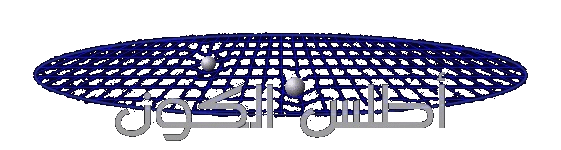
</h1>

صمم هذا الموقع ليقدم لنا فكرة عن هيئة الكون و كيف يبدو في الواقع
، يوجد تسع خرائط في هذه الصفحة و كل منها يمثل حجم الكون على مقياس مسافة كوني محدد 
 . الخريطة الأولى تظهر لنا النجوم المجاورة لشمسنا و تتدرج رحلتنا بمضاعفة المقياس عشرات المرات وفق تسلسل يرسم لنا خرائط للكون تزيد من إدراكنا لاتساعه الهائل إلى أن نبلغ أطراف الكون على المستوى النهائي و هي حدود الكون المرئي الذي نستطيع إدراكه بالمعدات المتوفرة لدينا في العصر الحالي.

<table class="toptable">
<tr><td rowspan="2"><a href="12lys.html">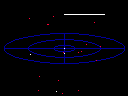</a></td>
    <th><a href="12lys.html">12.5 سنة ضوئية بعيدا عن الشمس</a></th></tr>
<tr><td>
النجوم الأقرب للشمس
إن أقرب نجم إلينا يبعد عنا أكثر من 7000 مرة بعد المسافة ما بيننا و أطراف المجموعة الشمسية .
في هذه الخريطة تظهر مجاميع النجوم القابعة على بعد 12.5سنة ضوئية من الشمس.
   </td></tr>

<tr><td colspan="2" class="center"></td></tr>
<tr><td rowspan="2"><a href="250lys.html">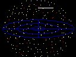</a></td>
    <th><a href="250lys.html">250 سنة ضوئية بعيدا عن الشمس</a></th></tr>
<tr><td>
جيران المجموعة الشمسية
إن القسم الأكبر من النجوم المرئية بالعين المجردة تقبع على مسافة 250سنة ضوئية من الشمس. هذه الخريطة تظهر لنا ذلك القسم من درب التبانة و الذي يحتوي النجوم التي تحيط بالشمس.
    </td></tr>

<tr><td colspan="2" class="center"></td></tr>
<tr><td rowspan="2"><a href="5000lys.html">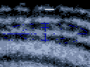</a></td>
    <th><a href="5000lys.html">5000 سنة ضوئية بعيدا عن الشمس</a></th></tr>
<tr><td>
ذراع الجبار في المجرة
تقبع الشمس و النجوم المجاورة لها ضمن الذراع المحلي ذراع الجبار. تظهر هذه الصورة ملايين النجوم المنتشرة على امتداد هذا الذراع حول الغيوم البينجمية الغازية.
    </td></tr>

<tr><td colspan="2" class="center"></td></tr>
<tr><td rowspan="2"><a href="galaxy.html">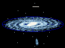</a></td>
    <th><a href="galaxy.html">50,000 سنة ضوئية بعيدا عن الشمس</a></th></tr>
<tr><td>
مجرة درب التبانة
مجرتنا اللولبية تحوي 200 بليون نجم يدور حول مركزها المحتشد و المزدحم بالنجوم. في هذا المخطط تظهر المعالم الرئيسية للمجرة.
    </td></tr>

<tr><td colspan="2" class="center"></td></tr>
<tr><td rowspan="2"><a href="sattelit.html">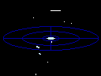</a></td>
    <th><a href="sattelit.html">500,000 سنة ضوئية بعيدا عن الشمس</a></th></tr>
<tr><td>
المجرات التابعة لدرب التبانة
يحيط بمجرتنا درب التبانة العديد من المجرات الصغيرة القزمة و التي تتخذ مدارا تتحرك فيه ببطئ حول مجرتنا بمعدل يصل لبلايين السنين. هذا المخطط تظهر فيه أقرب المجرات التابعة لمجرتنا درب التبانة.
    </td></tr>

<tr><td colspan="2" class="center"></td></tr>
<tr><td rowspan="2"><a href="localgr.html">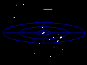</a></td>
    <th><a href="localgr.html">5 مليون سنة ضوئية بعيدا عن الشمس</a></th></tr>
<tr><td>
المجموعة المحلية
ترتبط مجرتنا درب التبانة بتأثير روابط جاذبية مع مجرتين لولبيتين كبيرتين بالإضافة لروابط جاذبية مع دستة من المجرات الصغيرة القزمة. هذه المجموعة المحلية تظهر جليا في هذا المخطط.
    </td></tr>

<tr><td colspan="2" class="center"></td></tr>
<tr><td rowspan="2"><a href="virgo.html">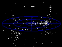</a></td>
    <th><a href="virgo.html">100 مليون سنة ضوئية بعيدا عن الشمس</a></th></tr>
<tr><td>
عنقود مجرات العذراء الفائق
المجموعة المحلية للمجرات ما هي إلا واحدة من التجمعات المجرية التي تتبع عنقود العذراء الهائل. هذه المجاميع المجرية مجتمعة في بنيان أكبر يدعى عنقود مجرات العذراء الفائق يظهر هنا في هذا المخطط.
    </td></tr>

<tr><td colspan="2" class="center"></td></tr>
<tr><td rowspan="2"><a href="superc.html">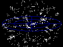</a></td>
    <th><a href="superc.html">1 بليون سنة ضوئية بعيدا عن الشمس</a></th></tr>
<tr><td>
العناقيد المجرية الفائقة المجاورة
يعتقد بأن توزع المجرات في الكون بعيد كل البعد عن الانتظام. غالبا ما تميل هذه المجرات إلى تشكيل تجمعات على شكل عناقيد مجرية فائقة الحجم و العدد . هذا المخطط تظهر فيه العديد من التجمعات المجرية الفائقة ضمن مدى ما يقارب ال 1 بليون سنة ضوئية من شمسنا.
     </td></tr>

<tr><td colspan="2" class="center"></td></tr>
<tr><td rowspan="2"><a href="universe.html">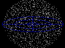</a></td>
    <th><a href="universe.html">14 بليون سنة ضوئية بعيدا عن الشمس</a></th></tr>
<tr><td>
حدود الكون المرئي
على الرغم من أن معرفتنا محدودة عن الكون على مقياس البنية الهائلة للكون و بعيدة عن الكمال. فإن العديد من المظاهر  الصغيرة و الكبيرة على أطراف الكون المرئي واضحة للعيان. فإن الكون متناسق بقدر كافي كما هو موضح في هذا المخطط.
 </td></tr>
</table>

قام بإنشاء هذا الموقع  <a href="me.html">Richard Powell</a>.
التحديث الأخير للموقع: 30 تموز-يوليو 2006 

	قام بترجمة الموقع إلى اللغة العربية :   <a href="metoo.html
">قتيبة أقرع

<a href="changes.html">مواضيع جديدة و تغييرات</a>

<table class="subtable">
<tr><td rowspan="2"><a href="glossary.html">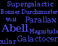</a></td>
    <th><a href="glossary.html">مصطلحات</a></th></tr>
<tr><td>مصطلحات مستخدمة في صفحات الموقع لشرح المفردات التي وردت عبر هذه الصفحات.</td></tr>

<tr><td rowspan="2"></td>
    <th><a href="links.html">روابط مفيدة</a></th></tr>
<tr><td>هنا نجد العديد من صفحات الويب التي تحتوي بعض الخرائط و الكثير من البيانات و المعلومات المتعلقة بالظواهر في الكون.</td></tr>

<tr><td rowspan="2"><a href="negative.html">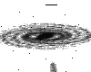</a></td>
    <th><a href="negative.html">صور نيجاتيف</a></th></tr>
<tr><td>هنا نجد بعض الصور بنسخة نيكاتيف من أجل استخدامها لطباعة بعض الموضوعات التي وردت في الموقع حيث الالوان معكوسة لتحقيق أفضلية للطباعة</td></tr>

<tr><td rowspan="2"></td>
    <th><a href="copyright.html">حقوق الطبع</a></th></tr>
<tr><td>هنا نجد بيانات حول حقوق استخدام النصوص و الخرائط و الصور لمن أراد استخدام أو طباعة أي جزء من هذا الموقع.</td></tr>
</table>
